## Flying Car Nanodegree Program
## Project 2: 3D Motion Planning
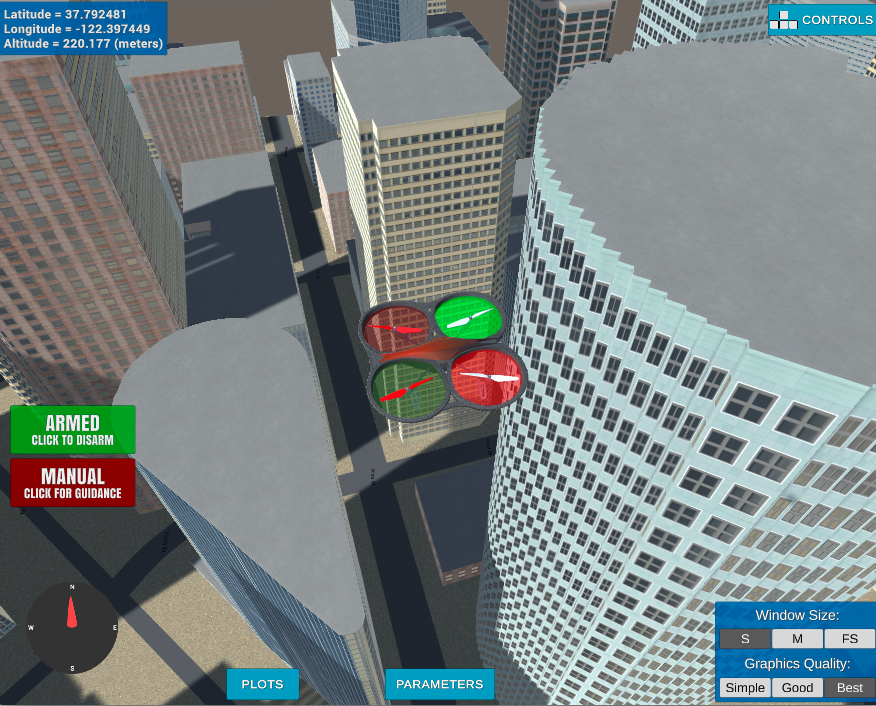

---

### Explain the Starter Code

#### 1. Explain the functionality of what's provided in `motion_planning.py` and `planning_utils.py`

With simulator started up, when running out of the box with the command line 
 
```sh
source activate fcnd
python motion_planning.py
```

The quad fly a jerky path of waypoints to the northeast. It is becuase in the `planning_utils.py`, the grid path planning algorithm only implemented 4 possible actions: north, west, east, south. When asked to find a path to the north east goal position diagonal to the start location, the planner has no choice but to give a solution to follow a jerky north, east, north, east, ... , north, east action path.

The other difference about `motion_planning.py` from the `backyard_flyer_solution.py` script inlcudes:
1. There is a new PLANNING state, being excuted after ARMING state and before TAKEOFF state.
2. After the ARMING state, a new function `plan_path()` is invoked, it does the following things:
  * set the state to `States.PLANNING`, 
  * load the 2.5D map in the colliders.csv file describing the environment and obstacle,

  

  * discretize the environment into a grid representation,
  * define the start and goal locations,
  * perform a search using A* search algorithm,
  * convert returned path to waypoints

Most functions called by `plan_path()` is provided in `planning_utils.py`.
  * `create_grid()` is the function to digitize the 2.5D map enviroment of free space and obstacle space into a grid representation of a 2D configuration space at given altitude and safety distance.
  * `Action()` defines possible actions represented by a 3 element tuple. The first 2 values are the delta of the action relative to the current grid position. The third one is the cost of performing the action. The default implementation only has 4 possition actions to the north, east, south, west. If diagonal action is necessary, more actions need to be added to the list (see next section for implementations). 
  * `valid_actions()` checks neighbors and return a list of possible actions that will not lead off the grid or bump into obstacle.
  * `a_star()` is the path planning search algorithm doing the heavy lifting. It exlores the 2D configuration space to find an optimal path based on minimizing the sum of two costs, the cost of the path from the start node to expansion frontier, and a heuristic estimatng the cost of the cheapest path from expansion frontier to the goal.
  * `heuristic()` is an estimate of the minimum cost from any point to the goal. Manhattan distance or euclidean distance can be used as heuristic for a grid. In the starter code, the euclidean distance is implemented.


### Implementing Path Planning Algorithm

#### 1. Set global home position
In my code, the first line of the csv file is read to extract **lat0** and **lon0** with the help of `split()` and `strip()` functions, then they were coverted from string to floating point values. Lastly  the `set_home_position()` method is used to set global home position. Make sure in this function, parameter *lon0* is before *lat0*.

```
# Read lat0, lon0 from colliders into floating point values
with open('colliders.csv') as f:
    first_line = f.readline()
    lat0 = float(first_line.split(',')[0].strip().split(' ')[1])
    lon0 = float(first_line.split(',')[1].strip().split(' ')[1])

# Set home position to (lon0, lat0, 0)
self.set_home_position(lon0, lat0, 0.0)
```

#### 2. Set your current local position
In the code, current global position is retrieved from `self._longitude, self._latitude, self._altitude`, then converted to local position with `global_to_local()` function. Make sure the order of the parameters, global position is (lon, lat, up), local position is (north, east, down).

But I found these lines of code are not necessary. Once global home position is set by `set_home_position()`. Local position is automatically been set. No need to call these function here, so I commented these lines out.

```
# Retrieve current global position
# global_position = (self._longitude, self._latitude, self._altitude)

# Convert current global position (lon, lat, up) to a local position (north, east, down)
# local_position = global_to_local(global_position, self.global_home)
```

#### 3. Set grid start position from local position

To find the start postion on the grid, subtract the lower left corner local position of the map from the current start local position. The original (0,0) shifted from the center of the map to the lower left corner (plus some safety margin).

```
grid_start = (int(self.local_position[0])-north_offset, 
              int(self.local_position[1])-east_offset)
```

#### 4. Set grid goal position from geodetic coords

First use global_to_local() to convert from goal global postion to goal local postion. Then again subtract north_offset and east_offset from coresponding coordinates to find the goal postion on the grid.

```
# Adapt to set goal as latitude / longitude position and convert
goal_global = (-122.4007, 37.7954, 28.0)
goal_local  = global_to_local(goal_global, self.global_home)
grid_goal = (int(goal_local[0])-north_offset, 
             int(goal_local[1])-east_offset)
```

The map below shows the location of the start (in green) and goal (in read) location.
 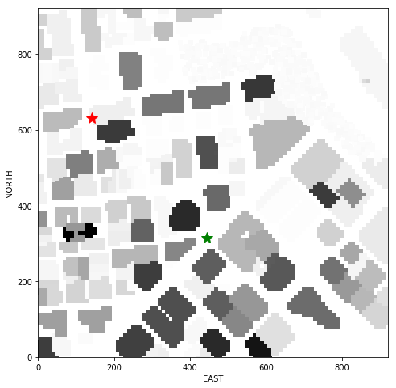

With start and goal location set on the map, we may start search for a posssible path to connect them!

#### 5. Modify A* to include diagonal motion
The code in `planning_utils()` is modified the A* implementation to include diagonal motions on the grid that have a cost of sqrt(2).

Add the following 4 possible diagnal motion actions to the `Action()` class:
```
NORTH_WEST = (-1, -1, np.sqrt(2))
NORTH_EAST = (-1, 1, np.sqrt(2))
SOUTH_WEST = (1, -1, np.sqrt(2))
SOUTH_EAST = (1, 1, np.sqrt(2))
```

then add the following checks to the `valid_actions()` method to make sure they are not off the grid or bump into obstacle:
```
# check if the node is off the grid or it's an obstacle

if x - 1 < 0 or grid[x - 1, y] == 1:
    valid_actions.remove(Action.NORTH)
if x + 1 > m or grid[x + 1, y] == 1:
    valid_actions.remove(Action.SOUTH)
if y - 1 < 0 or grid[x, y - 1] == 1:
    valid_actions.remove(Action.WEST)
if y + 1 > n or grid[x, y + 1] == 1:
    valid_actions.remove(Action.EAST)

if x - 1 < 0 or y - 1 < 0 or grid[x - 1, y - 1] == 1:
    valid_actions.remove(Action.NORTH_WEST)
if x - 1 < 0 or y + 1 > n or grid[x - 1, y + 1] == 1:
    valid_actions.remove(Action.NORTH_EAST)
if x + 1 > m or y - 1 < 0 or grid[x + 1, y - 1] == 1:
    valid_actions.remove(Action.SOUTH_WEST)
if x + 1 > m or y + 1 > n or grid[x + 1, y + 1] == 1:
    valid_actions.remove(Action.SOUTH_EAST)1] == 1:
```    

The figure below shows the path found by the A* search algorithm, with **489** way points between start and goal points.


#### 6. Cull waypoints 

It is unnecessary to ask drone to stop at every waypoints on the way. To eliminate unnecessary waypoints in the path, we may evaluate whether or not some points are collinear, then remove everything but the endpoints of each collinear series of points.

To check collinearity of two dimensional points, evaluating the determinant below. The determinant being equal to zero indicates that the area of the triangle described by those three points is zero and is a sufficient condition for collinearity:

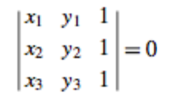

In the real world, points might not be exactly on a line, but we may still treat them as collinear. A threshold, epsilon, may be introduced to indicate how close to zero the determinant must be in order to consider the points to be collinear. This allows us to impose a criterion for accepting points that are almost collinear.

After pruning unecessary waypoints, there are only **22** out of 489 waypointsleft in the path.

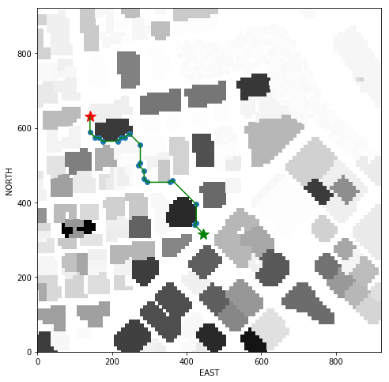

### Execute the flight
The drone in the simulator is able to fly following the found path. One problem is it takes a long time for the A* algorithm to calculate the path. The connection between the script and simulator timed out during this lenthy calculation. To work around it, I ran the script twice, first time to calculate a path, second time skip the calculation, fed previous calculated the waypoints to the simulator. The drone is able to fly from start to goal postion! The green spheres in the graph indicate each waypoints fed by the search algorithm after pruning.

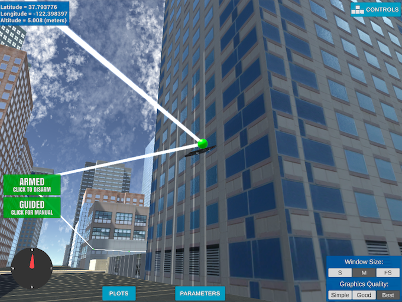
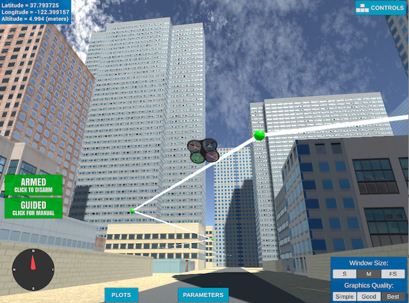
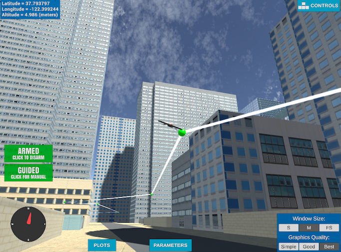
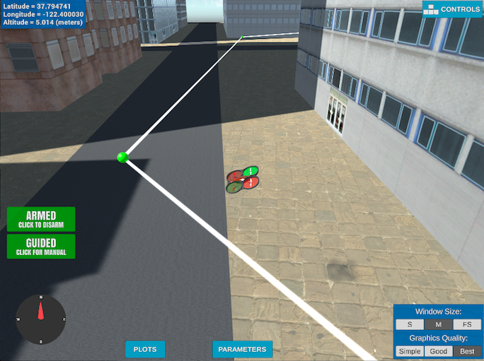
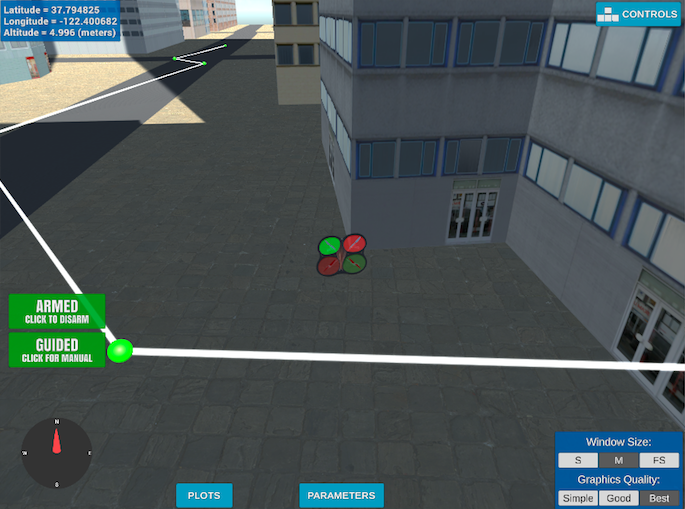

### Helix trajectory
Just for fun, I created waypoints that follows the helix trajectory:
```
for t in np.arange(0, T, dt):
    pt = [r*np.cos(np.deg2rad(w*t)), 
          r*np.sin(np.deg2rad(w*t)),
          TARGET_ALTITUDE + v_h*t,
          0]
    helix.append(pt)
```

The link to the movie is [here](./helix.mov)

A few pictures below:

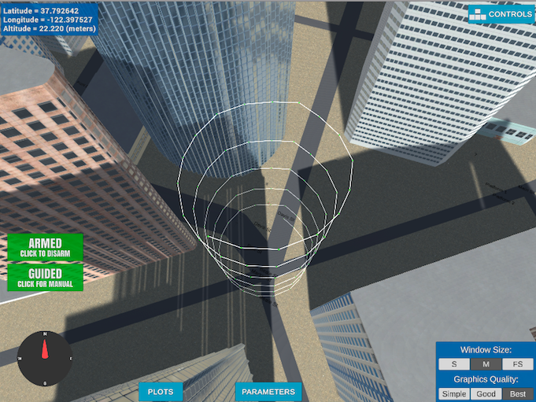
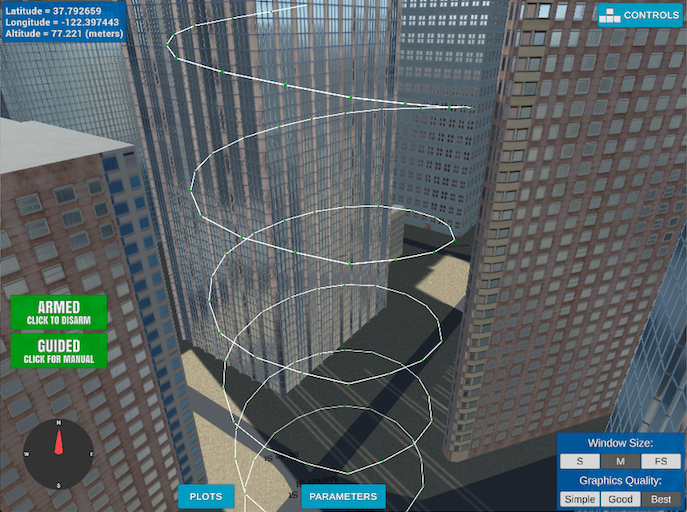
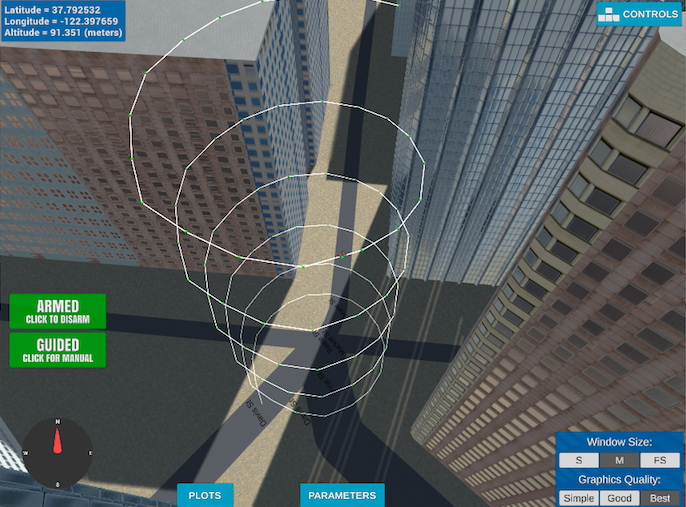
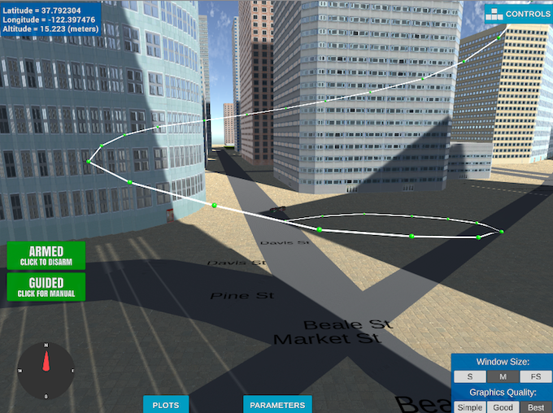
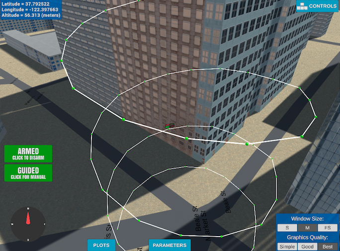

### Fly to the top of a building
To practice graph search and fly complex 3D trajectory so drone can land on the top of a building, one may adopt a time consuming 3D voxel grid search, or 3D random sampling and KD tree technique to connect nearest neighbor points. I took a shortcut in the project, reduced the search dimention to 2D to use Voronoi graph search. A Voronoi graph at a particular altitude was created once for an obstacle map and save to a file to save time for next time usage. 

With the help a built-in implementation of the Voronoi method from Python's SciPy library,  
```
from scipy.spatial import Voronoi
```
we may feed in a set of obstacles points to create a Voronoi() object that contains a graph of the deges that define the midline in free space between the obstacles, or in other words, the nodes in a graph that can navigate between the obstacles. Additional step is needed to check whether edgess are in collision with obstacles.

Note that the position of the top of the buiding is guaranteed to be an obstacle. It is possible that a start location is also on the top of the building. It is thus necessary to find closest points to the start and goal points on the Voronoi graph before start the path search from these two graph points.

A* search algorithm is modified accordingly. Instead of expending and checking exploration frontier to a fixed number of neigbors, the graph search expends to a variable number of neigboring points through its edge.

The graph search result shown on the map:

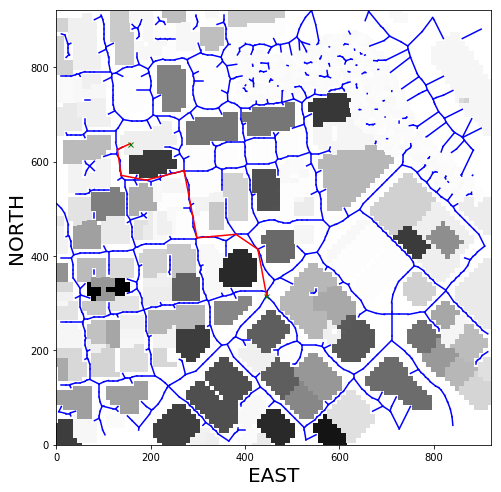

The change in the 3rd dimention is achived by gradualy increasing the altitude of it's way points proportional to the distance to the goal location with additional hight added to the final goal altitude so there's room for drone to land.

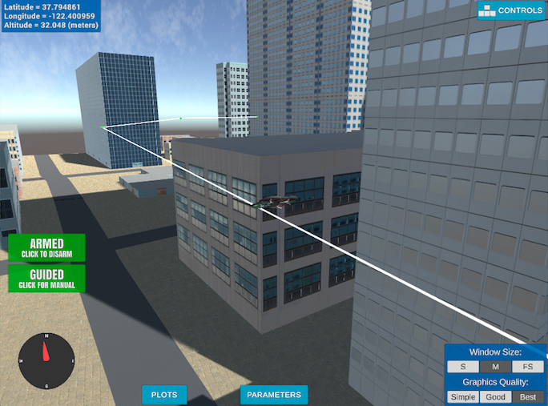
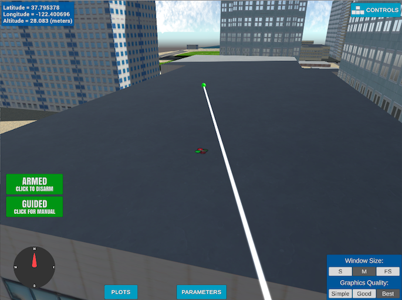


### Adding heading commands to your waypoints
In the default setup, waypoints are made up of NED position and headings are set to 0 in the default setup. When sending a heading to point to the next waypoint, drone can adjust its heading on the way to make sure it will always fly forward!
```python
# Define two waypoints with heading = 0 for both
wp1 = [n1, e1, a1, 0]
wp2 = [n2, e2, a2, 0]
# Set heading of wp2 based on relative position to wp1
wp2[3] = np.arctan2((wp2[1]-wp1[1]), (wp2[0]-wp1[0]))

```

The final video to fly to the top of the building can be found [here](P2_motion_planning.mp4).
